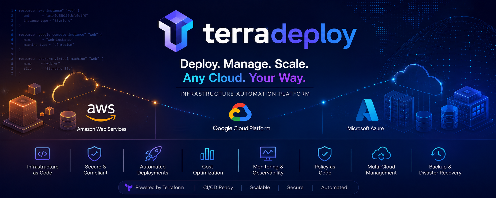
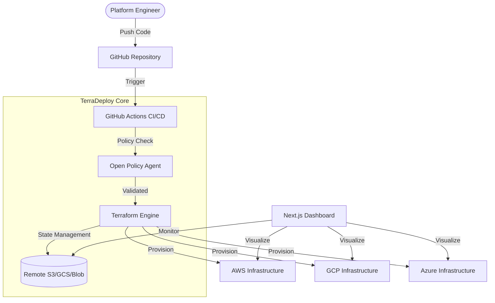

# <p align="center">🚀 TerraDeploy</p>

<p align="center">
  <strong>Enterprise-Grade Multi-Cloud Infrastructure Automation Platform</strong>
</p>

<p align="center">
  
  
  
  
  
  
</p>

<p align="center">
  
</p>

---

## 📖 Table of Contents
- [✨ Overview](#-overview)
- [🌟 Key Features](#-key-features)
- [🏗️ Architecture](#️-architecture)
- [🛠️ Tech Stack](#️-tech-stack)
- [📂 Project Structure](#-project-structure)
- [🚀 Getting Started](#-getting-started)
- [🛡️ Security & Governance](#️-security--governance)
- [📊 Monitoring & Observability](#-monitoring--observability)
- [🗺️ Roadmap](#️-roadmap)
- [📄 License](#-license)

---

## ✨ Overview

**TerraDeploy** is a production-grade cloud infrastructure automation platform designed to simplify and scale multi-cloud management. It provides a unified interface for deploying and managing resources across **AWS**, **GCP**, and **Azure**, wrapped in a modern dashboard with integrated security and CI/CD.

---

## 🌟 Key Features

-   **🌐 Multi-Cloud Orchestration**: Seamlessly manage AWS, GCP, and Azure using modular, reusable Terraform templates.
-   **🏢 Environment Lifecycle**: First-class support for `dev`, `staging`, and `prod` with remote state locking and workspace isolation.
-   **🖥️ Real-time Dashboard**: A stunning Next.js 14 dashboard featuring Framer Motion animations for infrastructure visualization.
-   **⚡ Advanced CI/CD**: Production-ready GitHub Actions pipelines with automated drift detection and manual approval gates.
-   **🔐 Security as Code**: Integrated **Open Policy Agent (OPA)** validation to enforce compliance before any resource is provisioned.
-   **📈 Intelligent Insights**: Cost estimation and performance optimization recommendations powered by cloud-native APIs.
-   **🩺 Health Checks**: Automated verification scripts to ensure infrastructure health and connectivity.

---

## 🏗️ Architecture



---

## 🛠️ Tech Stack

| Category | Technology |
| :--- | :--- |
| **Infrastructure** | Terraform, Open Policy Agent (OPA) |
| **Frontend** | Next.js 14, React, Tailwind CSS, Framer Motion |
| **CI/CD** | GitHub Actions |
| **Cloud Providers** | AWS, Google Cloud, Microsoft Azure |
| **Scripting** | Bash, Python |

---

## 📂 Project Structure

```bash
.
├── .github/workflows/       # 🚀 Enterprise CI/CD Pipelines
├── dashboard/               # 💻 Next.js 14 Web Interface
│   ├── src/                 # Application source code
│   └── public/              # Static assets
├── terraform/
│   ├── modules/             # 🧩 Reusable multi-cloud components
│   │   ├── aws/
│   │   ├── azure/
│   │   └── gcp/
│   └── environments/        # 🌍 Environment-specific configs (Dev/Prod)
├── policy/                  # 🛡️ OPA Security Policies (Rego)
├── scripts/                 # 🛠️ Automation & Health check utilities
└── README.md
```

---

## 🚀 Getting Started

### 📋 Prerequisites
- [Terraform](https://www.terraform.io/downloads) (>= 1.5.0)
- [Node.js](https://nodejs.org/) (>= 18.0.0)
- Cloud Provider CLI (aws, gcloud, or az)

### 1️⃣ Infrastructure Deployment
Navigate to your target environment and initialize the workspace:
```bash
cd terraform/environments/dev
terraform init
terraform plan -out=main.tfplan
terraform apply "main.tfplan"
```

### 2️⃣ Dashboard Setup
Launch the real-time visualization dashboard:
```bash
cd dashboard
npm install
npm run dev
```
The dashboard will be available at `http://localhost:3000`.

### 3️⃣ CI/CD Configuration
Configure the following secrets in your GitHub repository:
- `AWS_ACCESS_KEY_ID` / `AWS_SECRET_ACCESS_KEY`
- `GCP_PROJECT_ID` / `GCP_SERVICE_ACCOUNT_KEY`
- `ARM_CLIENT_ID` / `ARM_CLIENT_SECRET` (for Azure)

---

## 🛡️ Security & Governance

Security is baked into every deployment. Before any `terraform apply`, our CI/CD pipeline runs:
1. **Linting**: Ensures HCL best practices.
2. **OPA Scan**: Validates the `tfplan` against policies in `policy/infrastructure.rego`.
3. **Secret Scanning**: Prevents accidental exposure of credentials.

---

## 📊 Monitoring & Observability

TerraDeploy includes a comprehensive health check suite:
```bash
# Set execution permissions
chmod +x scripts/health-check.sh

# Run the suite
./scripts/health-check.sh --env dev
```
*Verification includes: Connectivity checks, API response times, and resource availability.*

---

## 🗺️ Roadmap

- [ ] 🤖 **AI-Driven Scaling**: Automated resource scaling based on traffic patterns.
- [ ] 📦 **Provider Registry**: Internal private registry for custom Terraform providers.
- [ ] 📱 **Mobile App**: Lightweight monitoring app for iOS/Android.
- [ ] ☁️ **Cloud Cost Dashboard**: Integrated billing and cost forecasting.

---

## 📄 License

This project is licensed under the [MIT License](LICENSE).

---

<p align="center">
  Built with ⚡ by <strong>Pranav Saraswat</strong>
</p>
